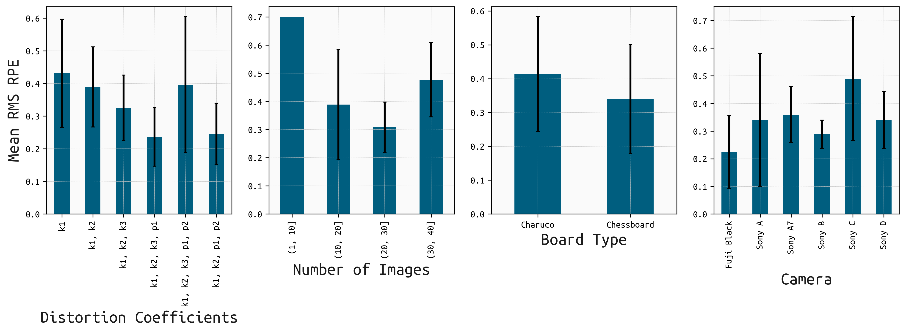

# Camera Calibration using OpenCV

There exist many resources for Camera Calibration and this has become a standard operating procedure. Here, we use OpenCV to calibrate single or stereo cameras using chessboard or ChArUco boards. We emphasize the importance of high-quality calibration boards that are on flat surfaces and not warped.

Alternative calibration options include importing calibration data produced with the [Calibrator calib.io Software](https://calib.io/products/calib), which relies on a different matrix-optimization approach and other flexible parameters. A python-based conversion code is available that converts output from Calibrator to the OpenCV XML camera matrix format.

**Table of Contents**
- [Usage](#Usage)
    - [Examples](#Examples)
- [Best practices for a good calibration](#best-practices)
    - [Image capture](#Image-capture)
    - [Calibration](#Calibration)
- [Our testing](#Our-testing)
    - [Different calibration approaches](#Different-calibration-approaches)
    - [Which distortion coefficients should be estimated during calibration?](#which-coefficents)

## Usage
The parameters have been optimized for the cameras that are available at the Geological Remote Sensing lab at the University of Potsdam. These are several Sony alpha-6 (24 MP), Sony alpha-7 (40 MP), and Fuji X-100 (24 MP) all with 55 mm or 85 mm fixed lenses.

The python code `python/single_camera_calibration_charuco_chess_openCV.py` can be called from the command line. Use `single_camera_calibration_charuco_chess_openCV.py -h` to obtain a short help and description of the parameters.

The code will read all calibration images from one directory, plots a summary figure showing all photos, performs the camera calibration, and writes the distortion coefficient and intrinsic camera calibration to an OpenCV XML file.

**Example of 49 photos showing a chessboard pattern for camera calibration (Sony alpha-7 55 mm lense):**


**All detected chessboard intersection - make sure that points are also taken from the corners of the image (Sony alpha-7 55 mm lense):**


**Example camera calibration and pixel distortion using intrinsic and distorted parameters (Sony alpha-7 55 mm lense):**


## Examples
Example call from Ubuntu command line (expecting OpenCV to be installed).

#### Using Sony alpha-6000 and charuco board

```bash
camA_initial_CC='cam_A_calib_9parameters_fine_charuco_20Feb2022.xml'
charuco_ifiles_camA='sony_stereo_f13_iso1600/charuco/black_a_stereo/DSC*.JPG'
camA_charuco_savexml_file='sony_stereo_f13_iso1600/charuco/cam_A_black_calib_9parameters_fine_charuco_25Mar2022.xml'
camA_CC_comparison_3panel_png='sony_stereo_f13_iso1600/charuco/CC_comparison_3panel.png'
camA_CC_comparison_1panel_png='sony_stereo_f13_iso1600/charuco/CC_comparison_1panel.png'
camA_Height=4000
camA_Width=6000
focal_length_pixels=9000

single_camera_calibration_charuco_chess_openCV.py --camA_initial_CC $camA_initial_CC \
  --charuco_ifiles_camA $charuco_ifiles_camA \
  --camA_charuco_savexml_file $camA_charuco_savexml_file \
  --camA_CC_comparison_3panel_png $camA_CC_comparison_3panel_png \
  --camA_CC_comparison_1panel_png $camA_CC_comparison_1panel_png \
  --camA_Height $camA_Height --camA_Width $camA_Width \
  --focal_length_pixels $focal_length_pixels
```

#### Using Sony alpha-7000 with fixed 55 mm lense and chess board

Using no initial calibration file and this requires setting the parameters *camA_Height*, *camA_Width*, and
*focal_length_pixels*.

```bash
chess_ifiles_camA='near/DSC*.JPG'
camA_chess_savexml_file='sony_alpha7_55m_CC_05July2022.xml'
camA_chess_75pbest_savexml_file='sony_alpha7_55m_CC_75p_05July2022.xml'
camA_CC_comparison_3panel_png='sony_alpha7_55m_CC_chess_comparison_3panel.png'
camA_CC_comparison_1panel_png='sony_alpha7_55m_CC_chess_comparison_1panel.png'
camA_Height=5304
camA_Width=7952
focal_length_pixels=12675

single_camera_calibration_charuco_chess_openCV.py  \
  --chess_ifiles_camA $chess_ifiles_camA \
  --camA_chess_savexml_file $camA_chess_savexml_file \
  --camA_chess_75pbest_savexml_file $camA_chess_75pbest_savexml_file \
  --camA_CC_comparison_3panel_png $camA_CC_comparison_3panel_png \
  --camA_CC_comparison_1panel_png $camA_CC_comparison_1panel_png \
  --camA_Height $camA_Height --camA_Width $camA_Width \
  --focal_length_pixels $focal_length_pixels
```

#### Using Sony alpha-7000 with fixed 85 mm lense and chess board

Using no initial calibration file and this requires setting parameters for camera calibration.

```bash
chess_ifiles_camA='near/DSC*.JPG'
camA_chess_savexml_file='sony_alpha7_85m_CC_05July2022.xml'
camA_chess_75pbest_savexml_file='sony_alpha7_85m_CC_75p_05July2022.xml'
camA_CC_comparison_3panel_png='sony_alpha7_85m_CC_chess_comparison_3panel.png'
camA_CC_comparison_1panel_png='sony_alpha7_85m_CC_chess_comparison_1panel.png'
camA_Height=5304
camA_Width=7952
focal_length_pixels=18918

single_camera_calibration_charuco_chess_openCV.py  \
  --chess_ifiles_camA $chess_ifiles_camA \
  --camA_chess_savexml_file $camA_chess_savexml_file \
  --camA_chess_75pbest_savexml_file $camA_chess_75pbest_savexml_file \
  --camA_CC_comparison_3panel_png $camA_CC_comparison_3panel_png \
  --camA_CC_comparison_1panel_png $camA_CC_comparison_1panel_png \
  --camA_Height $camA_Height --camA_Width $camA_Width \
  --focal_length_pixels $focal_length_pixels
```

## Best practices<a name="best-practices" />
### Image capture
Before capturing calibration images it is critical to ensure the camera is configured  and mounted properly, the board is high quality, and the scene is set appropriately to ensure a smooth calibration process.

#### Configuring the camera

##### Exposure settings
Calibration works best when the camera's internal settings (e.g. f-stop, shutter speed,  ISO) are fixed and constant for the calibration session. The cameras used here were placed into "Manual" mode (a feature on the majority of high-quality digital cameras today) and f-stop, shutter speed, and ISO manually set according to the lighting conditions at the time of the sessions.

##### Minimizing blur
When taking the photos it is important to minimize blur, so if it is not possible to use a remote shutter when capturing the images, consider enabling a short self-timer to avoid vibration at the time of capture.

The Sony cameras used in this study were also equipped with a "SteadyShot" feature which was disabled prior to shooting because, when enabled, it results in small adjustments being made to the internal mechanics of the lens to physically eliminate motion blur, but at the cost of slightly altering the lens's internal parameters and resulting in poorer calibration results. It is recommended that any automatic blur-reduction features are disabled.

The camera should be mounted on a tripod to ensure that its internal and geometric parameters remain constant throughout the session. **This is crucial for a good calibration and handheld photos result in a significantly worse result.**

#### Calibration targets<a name="calibration-targets" />
We recommend the use of a high-quality calibration board such as the aluminum composite checkerboard or CharuCo targets made by [Calib.io](https://calib.io/), because any inconsistencies in the target's flatness or pattern will affect the calibration results. Target stiffness is also important as it is recommended to place the board in multiple orientations (often requiring it to be leaned at an angle against another object).

We found that the checkerboard targets tended to provid better calibration results, but because the entire checkerboard needs to be within the frame at all times it can be somewhat tricky to align it perfectly in the corners (where the most distortion often is found). The CharuCo targets help with this issue as they do not need to be entirely in the frame, but at the cost of *slightly* worse results.

<table><tr>
    <td> 
      <p align="center" style="padding: 10px; text-align: center;">
        
        <br>
        <em style="color: grey">Calib.io Checkerboard Target</em>
      </p> 
    </td>
    <td> 
      <p align="center" style="padding: 10px; text-align: center;">
        
        <br>
        <em style="color: grey">Calib.io CharuCo Target</em>
      </p> 
    </td>
</tr></table>

#### Preparing the scene<a name="preparing-the-scene" />
<table><tr>
    <td> 
      <p align="center" style="padding: 10px; text-align: center;">
        
        <br>
        <em style="color: grey">A good setup makes things simple. Try to tilt the camera at a slightly more oblique angle to the ground than this, though.</em>
      </p> 
    </td>
</tr></table>

If performing the calibration indoors, a well-lit environment with minimal shadows is key. LED lighting panels are good for this. Place the tripod with the camera in front of the target area and tilt the camera to a slightly oblique orientation to the ground. In fact, we found that calibrations conducted with the camera at an angle to the ground as opposed to looking straight down resulted in lower calibration error. For quick and consistent target placement during the shooting, we found it helped to first place tape along the edge of the camera frame. This can be done by placing the target in one corner of the frame as precisely as possible and then using it as a guide to place the tape. Repeat for the other three corners.

#### Taking the photos
Once you have the frame marked out, we recommend taking 20-30 photos with the target covering every part of the frame at least once. Placing the target at oblique angles to the camera is also recommended, and for this we simply leaned the target up against an item in the lab and attempted to capture it in several different areas of the frame. If using the checkerboard, we had best results when placing it as close to the edge and in the corners of the frame as possible. This is simple when tape has been well-placed.

As mentioned above, we recommend the use of a remote shutter or using a short self-timer to minimize vibration-induced blur in the final shots. 

<table><tr>
    <td> 
      <p align="center" style="padding: 10px; text-align: center;">
        
        <br>
        <em style="color: grey">A checkerboard target placed at an oblique angle</em>
      </p> 
    </td>
</tr></table>

### Calibration
When using OpenCV or Calib.io, consider the following rules of thumb:
- Only 20-30 images are necessary
- If possible, estimate only for "k<sub>1</sub>, k<sub>2</sub>". Otherwise prefer "k<sub>1</sub>, k<sub>2</sub>, k<sub>3</sub>, p<sub>1</sub>, p<sub>2</sub>".
- Include between 20 and 30 images.

## Our testing
To inform the above recommendations, multiple calibration sessions were conducted with a variety of cameras, targets, image counts, and target-camera orientations. To analyze the success of a calibration, we looked at each calibration's root mean squared reprojection error (RMSE) and distortion plot. To compare two calibrations' distortion plots, we simply took the difference between the two.

### Different calibration approaches
#### Comparing calibration methods by RMSE

<p style="text-align: center;"><em style="color: grey; text-align:center;">Figure 1. To optimize the calibration process, we investigated the performance of estimating for different combinations of distortion coefficients (left), the number of images that should be included in the calibration (center-left), target type (center-right), and camera type (right).</em></p>

As can be seen in Figure 1, the following potential recommendations emerge:
- Include between 20 and 30 images.
- Use the Calib.io checkerboard (referred to as "chessboard" above), though the Calib.io CharuCo board also performs well.
- While it appears that using "k<sub>1</sub>, k<sub>2</sub>, k<sub>3</sub>", "k<sub>1</sub>, k<sub>2</sub>, k<sub>3</sub>, p<sub>1</sub>", or "k<sub>1</sub>, k<sub>2</sub>, p<sub>2</sub>, we decided to look further into the corresponding distortion plots.

### Which distortion coefficients should be estimated during calibration?<a name="which-coefficents" />
We conducted calibrations comparing different combinations of distortion coefficients, and found that there were diminishing returns (and the possibility of overfitting) when including coefficients beyond k<sub>1</sub> and k<sub>2</sub>.

#### Results of solving for different combinations of distortion coefficients


<p style="text-align: center;"><em style="color: grey; text-align:center;">Figure 2. Our results after solving for different combinations of distortion coefficients (using Calib.io). Left column: k<sub>1</sub>, k<sub>2</sub>; middle column: other coefficient combinations; right column: comparison plots.</em></p>

Figure 2 shows that, while the combinations of "k<sub>1</sub>, k<sub>2</sub>, k<sub>3</sub>", "k<sub>1</sub>, k<sub>2</sub>, k<sub>3</sub>, p<sub>1</sub>", and "k<sub>1</sub>, k<sub>2</sub>, p<sub>2</sub> result in low RMSE, their distortion plots are much more exaggerated. With this in mind, we believe it is best to do the following:

Avoid the following combinations, despite their low RMSE:
- Only k<sub>1</sub>
- k<sub>1</sub>, k<sub>2</sub>, k<sub>3</sub>
- k<sub>1</sub>, k<sub>2</sub>, k<sub>3</sub>, p<sub>1</sub>

Prefer: k<sub>1</sub>, k<sub>2</sub>